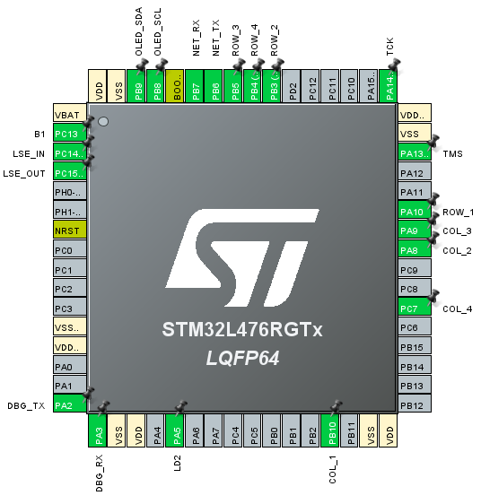

# 4100901-final-project
This repository contains the example for the final project of the course computation structures.

## Hardware prerequisites
The example consists of a digital lock system that uses an STM32L4 as the main controller to manage the system. Additionally, it integrates an ESP8266 for Internet connectivity, a keypad for sequence input, and an OLED screen for the graphical user interface (GUI). For detailed information about this model, please refer to the "Model C4" section. Below is the pinout diagram of the STM32:

## Firmware prerequisites
* The ESP8266 runs the esp-link [v2.2.3](https://github.com/jeelabs/esp-link/releases/tag/v2.2.3) firmware. Please follow the [serial flashing guide](https://github.com/jeelabs/esp-link/blob/master/FLASHING.md#initial-serial-flashing).
* The STM32 runs the firmware compiled from this repository using STM32CubeIDE.

## Building and Flashing
* Open the project in STM32CubeIDE.
* Compile using the current project settings.
* Use an ST-LINK to flash the firmware into the STM32.

## Functionality
*The Keypad: The keypad is an input component used in the digital lock system. Its main function is to allow users to enter sequences of numbers or characters to authenticate and unlock the lock. The keypad is essential for user interaction with the system and the input of key data.
*The Debug Console: The debugging console is an interface that provides detailed information about the internal operation of the system. It is an important tool for developers and technicians as it displays debugging messages, logs, and potential errors. It facilitates the identification and resolution of issues in the system.
*The Internet Interface: The internet interface refers to the capability of the digital lock system to connect and communicate with the Internet. This interface enables the system to send and receive data over the network, which can be essential for functions such as time synchronization, firmware updates, notifications, and more.
*The System Sends Metrics to the Internet: The system is configured to send metrics or relevant data over the Internet periodically, in this case, every 24 hours. This is achieved using an alarm from the integrated Real-Time Clock (RTC) in the system. The metrics may include information about the system's status, event logs, usage data, or other relevant information useful for remote management and monitoring.

## Contact info
* Sam C - saacifuentesmu@unal.edu.co
